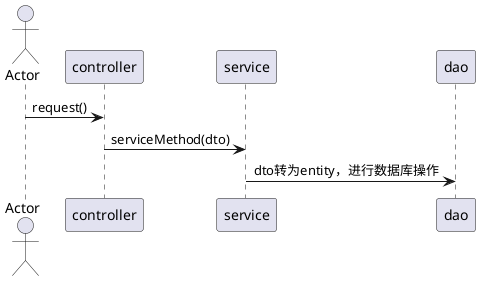

#### question
>程序中是否可以直接业务代码操作数据库映射的实体类？会不会有什么风险？
 

- [l] 直接操作数据库表的实体类对象，对应的字段都暴露出来
#### resolve
- [p] 使用自定义的dto进行业务逻辑编写
- [p] 使用bean拷贝
  >dto的实体类与entity的实体类进行转换


### DTO说明
- `data transform object`，数据传输对象
- [d] 用户更新自己的信息，例如修改密码的操作


```
用户提交页面-->ActionForm提取Form数据-->构造并对UserDTO赋值-->
调用业务方法changePassword(UserDTOdto)把DTO对象传入业务方法-->
业务方法内部把UserDTO转化为Entity User-->调用UserDAO.update(User)-->DAO调用hibernate进行持久化操作
```
- [b]  `DTO`: 凡是要通过网络传输的对象，都当做是DTO对象
>比如电商平台中，用户进行下单，下单后的数据，订单会发到OMS 或者 ERP系统，这些对接的返回值以及入参也叫DTO对象
>DTO对象对外，DTO 可以根据业务需要变更，并不需要映射 entity 的全部属性。
- [b]  `entity`：`entity` 是实体，会在数据库中存在的实际的表，包括它的每一个字段
- [] bean拷贝： DTO为系统与外界交互的模型对象，那么肯定会有一个步骤是将DTO对象转化为BO对象或者是普通的entity对象，`service层去处理`

## Bean拷贝
- [l] BeanUtils
>在SpringBoot项目中，我们通常会使用BeanUtils.copyProperties来实现对象属性拷贝。
  - [f] 缺点：BeanUtils.copyProperties的缺点很明显，如果对象中的字段发生了变化，就会导致拷贝失败，就会在项目中留下潜在的bug。
- [l] Cglib
>数据量比较大时并且想提高性能就用*Cglib的BeanCopier进行Bean拷贝*
>其性能要比Spring的BeanUtils，Apache的BeanUtils和PropertyUtils要好很多，尤其是数据量比较大的情况下。
  - [f] 缺点：Cglib由于Java版本到11会有warn警告在命令行，虽然性能提高，但是还是不建议使用

>那选择谁？
### mapstruct
>MapSturct 是一个生成类型安全， 高性能且无依赖的 JavaBean 映射代码的注解处理器（annotation processor）。
- [b] [mapstruct官网](https://mapstruct.org/documentation/dev/reference/html/#setup)
  - [p] 注解处理器
  - [p] 可以生成 JavaBean 之间那的映射代码
  - [p] 类型安全， 高性能， 无依赖性

- [i] 通过注解的方式帮我们实现 _JavaBean_ 之间的转换

#### pom导入
```xml
 <properties>
    <org.mapstruct.version>1.4.2.Final</org.mapstruct.version>
</properties>
<dependencies>
    <dependency>
        <groupId>org.mapstruct</groupId>
        <artifactId>mapstruct</artifactId>
        <version>${org.mapstruct.version}</version>
    </dependency>
</dependencies>
```

#### 转换类编写
- [p] 使用mapper注解，导入的包为mapstruct的包
```java
package top.testeru.sbm.converter;
import org.mapstruct.Mapper;
import org.mapstruct.Mapping;
import org.mapstruct.Mappings;
import top.testeru.sbm.dto.UserDTO;
import top.testeru.sbm.entity.User;

import java.util.List;

/**
 * @program: springboot-turorials
 * @author: testeru.top
 * @description:
 * @Version 1.0
 * @create: 2022/5/17 9:06 PM
 */
//生成的映射器是一个单例范围的 Spring bean，可以通过以下方式检索@Autowired
@Mapper(componentModel = "spring")
public interface UserConverter {
    @Mappings({
            @Mapping(target = "id",source = "id"),
            @Mapping(target = "userName",source = "userName"),
            @Mapping(target = "password",source = "password"),
            @Mapping(target = "email",source = "email")
    })
    User userDtoForUser(UserDTO userDto);
    @Mappings({
            @Mapping(target = "id",source = "id"),
            @Mapping(target = "userName",source = "userName"),
            @Mapping(target = "password",source = "password"),
            @Mapping(target = "email",source = "email")
    })
    UserDTO userForUserDto(User user);
    @Mappings({
            @Mapping(target = "id",source = "id"),
            @Mapping(target = "userName",source = "userName"),
            @Mapping(target = "password",source = "password"),
            @Mapping(target = "email",source = "email")
    })
    List<User> UserDTOListForUserList(List<UserDTO> userDtoList);
    @Mappings({
            @Mapping(target = "id",source = "id"),
            @Mapping(target = "userName",source = "userName"),
            @Mapping(target = "password",source = "password"),
            @Mapping(target = "email",source = "email")
    })
    List<UserDTO> UserListForUserDTOList(List<User> userList);
}
```

#### 验证
- controller层
```java
@RestController
public class UserController {
    @Autowired
    UserService userService;

//    用户注册
    @PostMapping(value = "/reg",produces = "application/json")
    String registerUser(@RequestBody UserDTO user){

        return userService.register(user);
    }
    //    用户更改信息
    @PostMapping(value = "/update",produces = "application/json")
    String updateUser(@RequestBody UserDTO user){
        return userService.update(user);
    }

    //    用户注销
    @PostMapping(value = "/dele",produces = "application/json")
    String deleteUser(@RequestBody UserDTO user){
        return userService.delete(user);
    }
    //    用户查询
    @PostMapping(value = "/find",produces = "application/json")
    List<UserDTO> findUser(@RequestBody UserDTO user){
        return userService.find(user);

    }
}
```

- service层
```java
package top.testeru.sbm.service.impl;

import cn.hutool.core.bean.BeanUtil;
import org.springframework.beans.factory.annotation.Autowired;
import org.springframework.stereotype.Service;
import tk.mybatis.mapper.entity.Example;
import top.testeru.sbm.converter.UserConverter;
import top.testeru.sbm.dao.UserMapper;
import top.testeru.sbm.dto.UserDTO;
import top.testeru.sbm.entity.User;
import top.testeru.sbm.service.UserService;


import java.util.Date;
import java.util.List;

/**
 * @program: springboot-turorials
 * @author: testeru.top
 * @description:
 * @Version 1.0
 * @create: 2022/5/17 2:38 PM
 */

@Service
public class UserServiceImpl implements UserService {

    @Autowired
    UserMapper userMapper;

    @Autowired
    UserConverter converter;

    @Override
    public String register(UserDTO userDto) {
        User user = converter.userDtoForUser(userDto);
        List<User> byNameUser = findByName(user);
        if(byNameUser.size()==0){
            System.out.println(user);
            user.setCreateTime(new Date());
            user.setUpdateTime(new Date());
            user.setFlag(0);
            //保存一个实体，null的属性不会保存，会使用数据库默认值
            int insertNum = userMapper.insertSelective(user);
            System.out.println("插入 " + insertNum + "条数据");
            if(insertNum >0){
                return "注册成功";
            }
            return "注册失败";
        }else {
            return "该用户名已经注册";
        }

    }

    @Override
    public List<UserDTO> find(UserDTO userDto) {
        User user = converter.userDtoForUser(userDto);
        List<User> userList = findByName(user);
        return converter.UserListForUserDTOList(userList);

    }


    /**
     * 根据用户名查找用户
     * @param
     * @return
     */
    private List<User> findByName(User user) {
        Example example = new Example(User.class);
        Example.Criteria criteria = example.createCriteria();
        criteria.andEqualTo("userName", user.getUserName());
        criteria.andEqualTo("flag", 0);
        List<User> userList = userMapper.selectByExample(example);
        System.out.println("userlist:");
        userList.forEach(System.out::println);
        return userList;
    }

    @Override
    public String delete(UserDTO userDTO) {

        return upAndDele(userDTO,"del");
    }


    @Override
    public String update(UserDTO userDto) {

        return upAndDele(userDto,"up");
    }


    private String upAndDele(UserDTO userDto, String str) {
        User user = converter.userDtoForUser(userDto);
        List<User> byNameUser = findByName(user);

        if("up".equals(str)){
            str = "更新用户";
        }else if("del".equals(str)){
            str = "删除用户";
            user.setFlag(1);
            user.setEmail(null);
            user.setPassword(null);
        }


        if(byNameUser.size()!=0){
            //放入主键
            user.setId(byNameUser.get(0).getId());
            //更新的时间
            user.setUpdateTime(new Date());
            System.out.println(user);
            int updateNum = userMapper.updateByPrimaryKeySelective(user);
            System.out.println("更改 " + updateNum + "条数据");
            if(updateNum >0){
                return str + "成功";
            }
            return str + "失败";
        }else {
            return "该用户不存在";
        }
    }
}

```