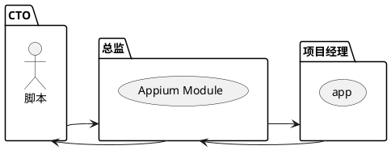

# 概述

- 目前mobile自动化解决方案
- Appium介绍
- Appium框架介绍
- Appium环境安装

## 目前mobile自动化解决方案

> 目前市面上有2大操作系统，一个就是IOS一个就是安卓，当然还有新增的鸿蒙，其实鸿蒙也可以当作是安卓手机来进行测试；
>
> 但是通用测试框架就比较少 
>
> Macaca社区生态相对不完善，维护也不活跃，用户量相对少

| iOS              | Android      |
| ---------------- | ------------ |
| calabash-ios     | calabash-ios |
| Frank            | MonkeyTalk   |
| UIAutomation     | RObotium     |
| iOS-driver       | UiAutomator  |
| KeepItFunctional | selendroid   |
| Macaca           | Macaca       |
| Appium           | Appium       |

## 自动化工具选择

| 工具名称     | 被测系统 | 脚本语言    | 是否支持H5 | 是否支持跨应用 | 工具稳定性 | 是否为sdk自带 |
| ------------ | -------- | ----------- | ---------- | -------------- | ---------- | ------------- |
| MonkeyRunner | Android  |             | Y | N | 稳定 | Y |
| Monkey | Android  | Java | N | N | 稳定 | Y |
| Uiautomator2 | Android  | Java        | Y          | Y              | 稳定       | Y             |
| Uiautomation | iOS | 弃用 |            |                |            |               |
| Adb-For-Test | Android  | Java/Python | Y          | Y              | 稳定       | Y             |
| Appium | Android,iOS | Java/Python/JS/C# | Y | Y | 一般 | N |

- [monkeyrunner](https://developer.android.com/studio/test/monkeyrunner?hl=zh-cn) ：工具与 [UI/Application Exerciser Monkey](https://developer.android.com/tools/help/monkey?hl=zh-cn)（即 `monkey` 工具）无关。`monkey` 工具直接在设备或模拟器上的 `adb` shell 中运行，并生成伪随机用户和系统事件流。相比之下，monkeyrunner 工具通过从 API 发送特定命令和事件来从工作站控制设备和模拟器。monkeyrunun 工具使用 [Jython](http://www.jython.org/)，这是一种使用 Java 编程语言的 Python 实现。Jython 使 monkeyrunner API 能与 Android 框架轻松交互。借助 Jython，您可以使用 Python 语法访问 API 的常量、类和方法。
- Uiautomator2：是一个自动化测试开源工具，仅支持android平台的自动化测试，其封装了谷歌自带的*uiautomator2*测试框架

- Uiautomation：windows的ui自动化

#### 选择条件

- 单平台测试/多平台测试？
- 是否多设备同时测试？
- 不局限测试环境，任何版本、任何环境都可以测试？
- 最擅长开发语言
- 当前市面是否有满足项目需求的测试工具？是否需二次开发？

# Appium

## 应用划分

- 原生应用

  - 是指用android或iOS编写的应用

  - andriod sdk组件开发的应用

    > 实际上是一种基于智能手机本地操作系统如Android、IOS和Windows Phone并且使用原生程序编写运行的第三方移动应用程序。[**开发原生App软件**](https://www.apicloud.com/)需要针对不同智能手机的操作系统来选择不同的App开发语言，如安卓App是Java开发语言、IOS APP是Objective-C语言、Windows Phone的APP开发是C##语言。
    >
    > 1、每一种移动操作系统都需要独立的开发项目。
    >
    > 2、每种平台都需要独立的开发语言。Java(Android), Objective-C(iOS)以及Visual C++(Windows phone)等等。
    >
    > 3、需要使用各自的软件开发包，开发工具以及各自的控件。
    >
    > 能够与移动硬件设备的底层功能，比如个人信息，摄像头以及重力加速器等等。 
    >
    > 1、直接下载到设备。
    >
    > 2、以独立的应用程序运行(并不需要浏览器)。
    >
    > 3、用户必须手动去下载并安装这些原生App。
    >
    > 4、有一些商店与卖场来帮助用户寻找你的App，目前app市场不计其数。

- 移动网页应用

  - 是指网页应用，类似于iOS中safari应用或者Chrome应用或者类似浏览器的应用。

- 混合应用

  - 是指一种包裹webview的应用，原生应用网页内容交互性的应用。
  - 微信小程序就是混合应用，原生应用是微信，内嵌的小程序是webview的应用

## 什么是Appium

[appium简介](http://appium.io/docs/en/about-appium/intro/)

- 移动端的自动化测试框架 
  - 可用于测试原生应用，移动网页应用和混合应用，且是跨平台的。

- [p] 第三方自动化工具
  - 底层用到的是Selenium WebDriver相关的协议，在这个基础上添加的移动端的API
- [p]  app自动化测试
- [p] 开源的、跨平台的
  - ios、Android、Window、Mac
  - 何为跨平台，意思是可以针对不同平台用一套api来编写脚本。
- [p] **Client/Server Architecture**：c/s架构
  - 客户端通过WebDriver json wire协议与服务端通讯

- [p] 脚本多语言支持
  - Java、Python、ruby、PHP、JavaScript、C#

- [p] 生态丰富，社区强大

## Appium原理

> 1、中间是Appium Server 首先启动起来，会占用一个端口
>
> 2、开始写我们自己的脚本，比如先启动手机app，写好脚本后，我们对应的脚本代码运行，会发送一个请求给Appium Server，告诉它帮我去怎么操作手机上的app
>
> 3、这个时候如果对应的脚本参数都是正确的，则会按着我们写的脚本步骤，打开app操作

> 这里需要注意2点：第一就是无论脚本跟Appium Server交互发送请求，还是Appium Server跟手机app交互发送请求，都是用的http协议的请求
>
> 第二，就是app启动后，Appium Server会创建一个session进行脚本跟app之间的请求转发，不是每次都重新启动
>
> 我们写的脚本就相当于Appium的客户端
>
> Appium的客户端和服务端之间进行通信必须在一个session的上下文中进行。客户端发起通信的时候会首先发送一个叫做“Desired Capabilities”的JSON对象给服务端。服务端接收到该数据后，会创建一个session并将session的ID返回给客户端，之后客户端会用该session的ID发送后续的命令。

我们在手机启动app的时候会发现，在手机上第一次会安装一个appiumsetting还有一个就是uiautomator test 

​	安装成功后才能进行后续的启动

#### 比喻

脚本就是大Boss-CTO，Appium Server就是总监，有一个大客户需要现场解决问题的需求，这个时候CTO「脚本」给总监「Appium Server」发消息/打电话，把客户基本情况说了一下。

然后总监「Appium Server」{总监也不知道里面具体的业务代码} 就立即找了项目经理「webdriver」，给项目经理「webdriver」说这个项目以后就是你负责，赶紧去客户现场，

项目经理「webdriver」就带人去了客户现场，安排手下的人干活，解决客户需求。

在做这个项目期间就需要项目经理「webdriver」给公司同步这个需求进度、客户反馈这些问题，项目经理「webdriver」反馈给总监「Appium Server」，总监「Appium Server」反馈给CTO「脚本」，不能越级上报，最后CTO「脚本」知道结果。

### Appium通信原理

>

Client端发送自动化指令给Appium **server**，Appium Server接收到client发送的指令后，转换为移动端能够识别的指令，然后发送给移动端设备，并对移动端设备进行操作。

### Appium Server

server里面不只有webDriver「安卓driver、 iOSdriver」还有各种工作引擎

>对应github上有很多driver，appium就相当于一个集装箱，把github这些driver全部都集成过来。所以在我们写脚本的时候，我们就需要告诉appium当前我要用的是什么server
>就好比我们总监手下有android开发，有iOS开发、有服务端开发，那到底客户需求是需要什么呢，在CTO给总监说客户需求的时候就要说明，是要做哪一端的开发需求「设备是iOS还是安卓」，是用什么语言去开发，有Java、python、Go、JS等等「app是京东还是淘宝」
>就是我们在写脚本的时候，需用声明对应的设备是iOS的还是Android的还是Mac的，对应的被测试的app是淘宝还是京东

### Appium工作引擎

> 不同的系统对应的引擎是不同的
>
> 这些都放在了appium里面，脚本配置对应的driver，

| Platform | Driver                                                       | Platform Versions | Appium Version |
| -------- | ------------------------------------------------------------ | ----------------- | -------------- |
| iOS      | [XCUITest](http://appium.io/docs/en/drivers/ios-xcuitest/)「推荐」 | iOS 9.3+          | Appium 1.6+    |
|          | [UIAutomation](http://appium.io/docs/en/drivers/ios-uiautomation/)「弃用」 | iOS 9.3-          | All            |
| Android  | [UiAutomator](http://appium.io/docs/en/drivers/android-uiautomator/index.html#TODO) | All               | Appium 1.14+   |
|          | [UiAutomator2](http://appium.io/docs/en/drivers/android-uiautomator2/)「推荐」 | Android5.0+       | Appium 1.6+    |
|          | [Espresso](http://appium.io/docs/en/drivers/android-espresso/) |                   | Appium 1.9+    |
| Mac      | [appium-mac-driver](https://github.com/appium/appium-mac-driver) | Mac OS X 10.7     | Appium 1.6.4+  |
| Windows  | [windows](http://appium.io/docs/en/drivers/windows/)         | Windows 10        | Appium 1.6+    |

