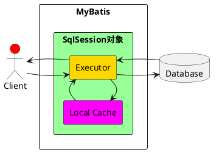

`````ad-caution
title:缓存

```ad-need
title:MyBatis缓存
为什么使用缓存？？？
```

>当用户频繁查询某些固定的数据时：
>第一次将这些数据从数据库中查询出来,保存在缓存中。
>当用户再次查询这些数据时,不用再通过数据库查询,而是去缓存里面查询。

>减少网络连接和数据库查询带来的损耗,从而提高我们的查询效率,减少高并发访问带来的系统性能问题。


```ad-important
color: 220, 20, 60
title:概括

经常查询一些不经常发生变化的数据，用缓存来提高查询效率
```
像大多数的持久化框架一样，Mybatis也提供了缓存策略，通过缓存策略来减少数据库的查询次数，
从而提高性能。
- [!] Mybatis中缓存分为一级缓存，二级缓存
`````
## 一级缓存

```ad-important
color: 60, 219, 20
title:介绍

- [!] 一级缓存是SqlSession级别的缓存，是<span class="red">默认开启</span>的

所以在参数和SQL完全一样的情况下，

我们使用同一个SqlSession对象调用一个Mapper方法，往往只执行一次SQL，

因为使用SelSession第一次查询后，MyBatis会将其放在缓存中，

以后再查询的时候，如果没有声明需要刷新，并且缓存没有超时的情况下，

SqlSession都会取出当前缓存的数据，而不会再次发送SQL到数据库。
```





#### 测试代码
```java
public class NestedTest {
    @Test
    void test1() throws IOException {
        InputStream resourceAsStream = Resources.getResourceAsStream("sqlMapConfig.xml");
        SqlSessionFactory sqlSessionFactory = new SqlSessionFactoryBuilder().build(resourceAsStream);
        SqlSession sqlSession = sqlSessionFactory.openSession();
        OrderMapper mapper = sqlSession.getMapper(OrderMapper.class);
        List<Order> allWithUser1 = mapper.findAllWithUser();
        allWithUser1.forEach(System.out::println);
        System.out.println("----------------");
        List<Order> allWithUser2 = mapper.findAllWithUser();
        allWithUser2.forEach(System.out::println);
        sqlSession.close();
    }
}
```

- [<] 查询了两次，但最后只执行了一次数据库操作，这就是Mybatis提供给我们的一级缓存在起作用了。

>因为一级缓存的存在，导致第二次查询记录时，并没有发出sql语句从数据库中查询数据，而是从一级缓存中查询。


````ad-tip
1. 第一次发起查询请求，先去缓存中找是否有对应信息；如果没有，则去数据库查询
2. 得到相关结果，放入缓存中
3. 如果同一个SqlSession，去执行commit操作「增删改」，则会清空一级缓存。这样目的，为了让缓存中存储最新信息，避免脏读
4. 第二次发起查询请求，先去缓存中找是否有对应信息；如果没有，则去数据库查询；如果有，则直接使用缓存信息
>sqlSession是一个Map key=value，sql语句是key，对应的查询结果是value
````


#### 测试代码
前后查询中间使用清空缓存验证
```java
sqlSession.clearCache();
```


> 在<span class="red">select</span>标签上添加对应的<span class="purple">flushCache="true"</span>对应的缓存都会清空